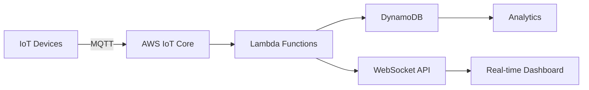

# 👋 Hi, I'm Baniprasad Mangaraj  
**DevOps Automation Engineer | AWS | Kubernetes | CI/CD | Cloud & IoT**

<div align="center">
  
</div>

<div align="center">
  
</div>

<p align="center">
  
</p>

<div align="center">
  
[](https://github.com/BaniprasadMangaraj)
[](https://www.linkedin.com/in/baniprasad-mangaraj-b94aab20b/)
[](mailto:baniprasadmangaraj2@gmail.com)

</div>

---

## 🚀 About Me


```yaml
name: Baniprasad Mangaraj
role: DevOps Automation Engineer
experience: 2.5+ years
company: Ajatus Software Pvt Ltd
location: Odisha, India
focus:
  - Cloud Automation
  - CI/CD Pipelines
  - Kubernetes Orchestration
  - IoT Architecture
  - Infrastructure as Code
  - Monitoring & Observability
```

I am passionate about building **scalable, secure, and highly available** cloud infrastructure. I specialize in **automating everything** to make deployments faster, safer, and more reliable.

💡 **Philosophy:** *"Automate repetitively, innovate continuously"*

<br clear="right"/>

---

## 🧠 What I Do

<div align="center">
  
</div>

- Design & maintain **CI/CD pipelines** (Jenkins, GitLab CI, GitHub Actions)
- Build & manage **AWS cloud infrastructure**
- Deploy & scale apps using **Docker & Kubernetes**
- Automate infra with **Terraform & Ansible**
- Implement **monitoring, logging & alerting**
- Build **real-time IoT and serverless architectures**
---

## 🛠️ Tech Stack & Expertise

<div align="center">
  
</div>


<div align="center">

### ☁️ Cloud Platforms


### 🐳 Containers & Orchestration


### 🔧 CI/CD & Automation


### 🏗️ Infrastructure as Code


### 📊 Monitoring & Logging


### 💻 Operating Systems & Tools


</div>

<div align="center">
  
</div>

<div align="center">
  
</div>

## 🏆 Career Highlights

<div align="center">
  
</div>

<div align="center">

| 🎯 Achievement | 📈 Impact |
|:--------------|:---------|
| 🚀 **CI/CD Optimization** | Reduced deployment time by **40%** using CI/CD automation |
| 🐳 **Kubernetes Migration** | Improved **scalability & resource usage** using Kubernetes |
| ☁️ **Infrastructure Automation** | Automated AWS infra using **Terraform & Ansible** |
| 📊 **Full-Stack Monitoring** | Built **monitoring** with Prometheus, Grafana & CloudWatch |
| 🔐 **DevSecOps Implementation** | Implemented **DevSecOps** security checks inside pipelines |

</div>

---

## 🔥 Featured Projects

<div align="center">

### 🚀 No-Counter IoT Platform
**Tech Stack:** AWS IoT Core • Lambda • DynamoDB • WebSockets • CloudWatch

</div>



**Key Features:**
- 🔄 Real-time RFID data processing with sub-second latency
- 🔐 Secure device authentication using X.509 certificates
- 📊 Live dashboards with WebSocket streaming
- 🚀 Auto-scaling architecture supporting 10K+ concurrent devices
- 📈 CloudWatch monitoring with custom metrics

---

<div align="center">

### ♻️ Recycle Pay – Cloud Marketplace


**Tech Stack:** AWS EKS • GitHub Actions • Helm • Terraform • Prometheus

</div>

**Architecture Highlights:**
- 🏗️ Multi-AZ EKS cluster with auto-scaling node groups
- 🔄 GitOps-based deployments using GitHub Actions
- 📦 Helm charts for multi-environment consistency
- 🔍 Centralized logging with ELK stack
- 📊 Custom Grafana dashboards for business metrics

**DevOps Achievements:**
- ✅ 99.9% uptime with zero-downtime deployments
- ✅ 60% faster rollbacks with Helm versioning
- ✅ Automated security scanning in CI pipeline

---

<div align="center">

### 🏭 Giovani Fabrics – ERP System


**Tech Stack:** Docker • Ansible • Jenkins • Linux • Nginx

</div>

**Infrastructure Improvements:**
- 🐳 Containerized monolithic application for consistency
- 🤖 Ansible playbooks for configuration management
- 🔄 Automated backup and disaster recovery
- 📈 Reduced deployment time from 2 hours to 15 minutes
- 🛡️ Improved system uptime from 95% to 99.5%

---

## 🎓 Education

**B.Tech in Mechanical Engineering**  
Gandhi Engineering College | 2015 – 2019

*Transitioned from Mechanical to DevOps through self-learning and hands-on projects*

---

## 🌐 Let's Connect
<div align="center">
  
</div>

<div align="center">

[](https://www.linkedin.com/in/baniprasad-mangaraj-b94aab20b/)
[](https://github.com/BaniprasadMangaraj)
[](mailto:baniprasadmangaraj2@gmail.com)
[](https://github.com/BaniprasadMangaraj)

**💡 Open for DevOps opportunities | Cloud consulting | Tech collaborations**

</div>

---

## ⚡ Beyond DevOps

<div align="center">

| 🏏 Cricket Enthusiast | 💪 Fitness Lover | 🌱 Gardening Passion |
|:---:|:---:|:---:|
| *Follow cricket matches* | *Regular gym-goer* | *Growing plants* |

| 🎮 Gaming | 🌍 Travel | 📚 Continuous Learning |
|:---:|:---:|:---:|
| *Mobile & PC games* | *Exploring new places* | *Tech blogs & courses* |

</div>

---

<div align="center">
  
### 💭 "Automate everything so humans can focus on innovation" 💭

**Open for DevOps opportunities and collaborations!**


</div>

---

<div align="center">
  
</div>
